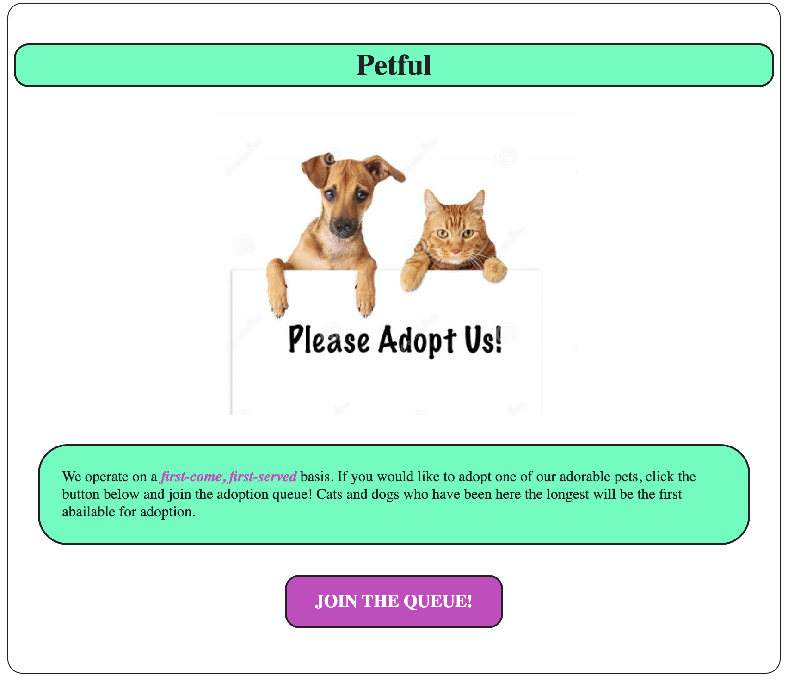
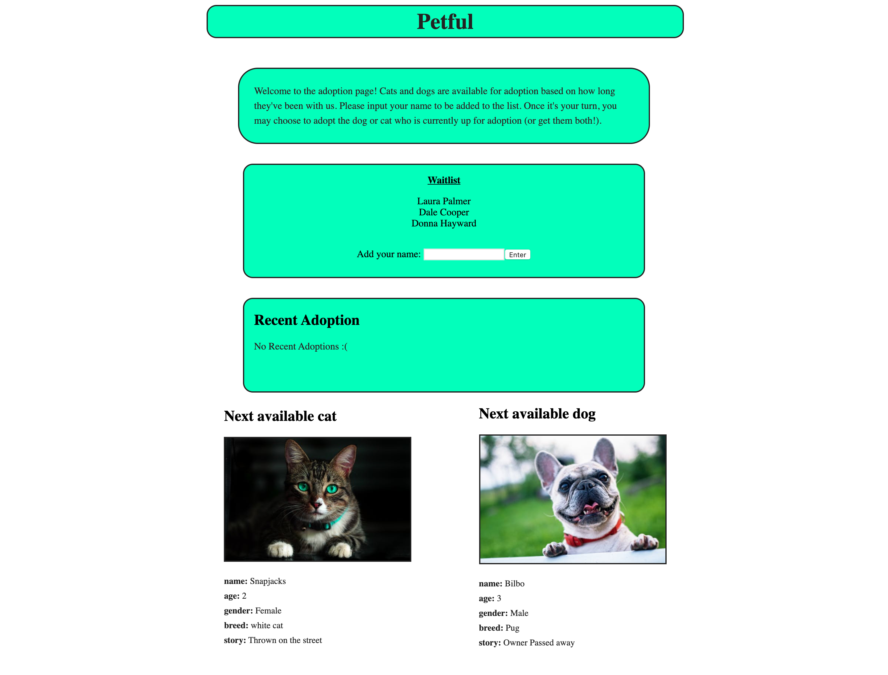

# Petful

Live: https://the-petful-app.now.sh/

## Summary
Petful is a website that simulates a pet adoption system for an animal shelter. There are two types of animals: cats and dogs. 
The adoption system is based on FIFO (First In First Out), so the animals that came to the shelter first will be the first ones put up for adoption.
People can adopt a cat, or a dog, or both, however you can only adopt a pet when it is your time in the queue. People who want to adopt enter their name
on the website and they will be added to another FIFO Queue. After you've waited your turn in line, you have the ability to make your choice.

## Technology Used
* React
* Node
* Express

## Screenshots

---

## Authors
[Matthew Wagaman](https://github.com/AveraqeDev)